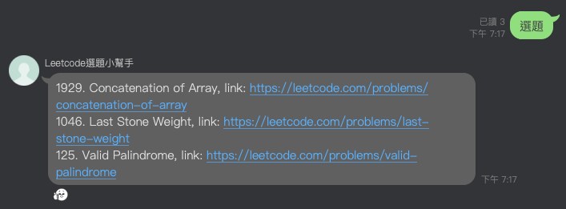

# LINE Bot - Leetcode question picker

The bot randomly picks Leetcode questions for you.



## Usage

After deploying the application and configuring the LINE official account webhook settings, your official account should
be ready to serve with following commands.

| Command          | Description                                                                                                                                                                         |
|------------------|:------------------------------------------------------------------------------------------------------------------------------------------------------------------------------------|
| `選題`             | Pick three easy questions                                                                                                                                                           |
| `選題[xE][xM][xH]` | Pick questions with difficulty specified. For example, `選題1E2M3H` means 1 easy question, 2 medium questions, and 3 hard questions. Possible commands include `選題1E`, `選題3E2H`, etc. |

## Deployment

1. Build a Docker image.

    ```bash
    docker image build --platform amd64 -t leetcode-picker:latest .
    ```    

2. Find a place to host the application.
3. Configure environment variables.

| env                   |
|:----------------------|
| `LINE_CHANNEL_TOKEN`  |
| `LINE_CHANNEL_SECRET` |

## Development

We use `pipenv` to manage the dependencies. Check [development doc](docs/Development.md) for more details.
